# System Architecture

## Architectural Overview

The `sb` benchmark tool follows a multi-layered architecture designed for high-performance, concurrent benchmarking of Valkey/Redis-compatible servers.

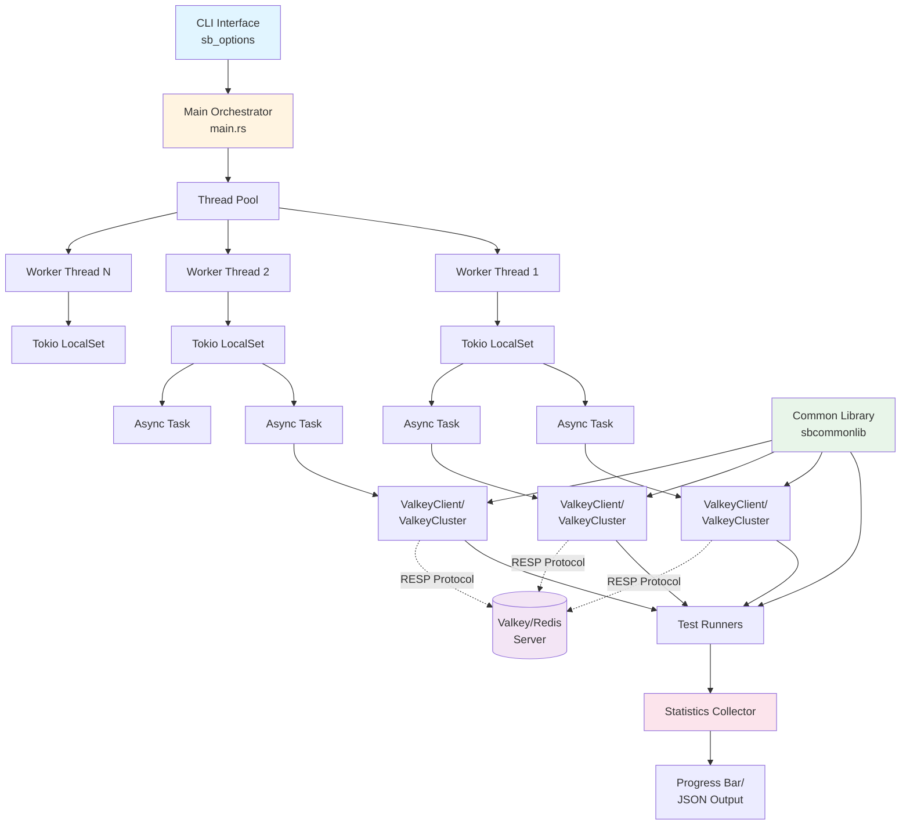

## Architectural Patterns

### 1. **Layered Architecture**

The system is organized into distinct layers:

- **Presentation Layer** - CLI interface with argument parsing
- **Application Layer** - Test orchestration and coordination
- **Business Logic Layer** - Test implementations and benchmark logic
- **Protocol Layer** - RESP protocol handling (builder/parser)
- **Transport Layer** - Network I/O with TLS support

### 2. **Concurrent Task Model**

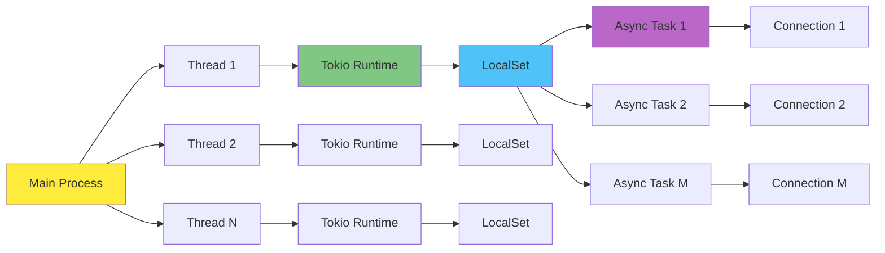

**Key Characteristics:**
- N OS threads (configurable via `--threads`)
- Each thread runs a dedicated Tokio current-thread runtime
- Tasks run on `LocalSet` for better performance (no thread synchronization)
- M connections per thread (calculated as `connections / threads`)
- Each async task manages one TCP connection

### 3. **Plugin-Style Test Architecture**

Tests are implemented as independent modules that follow a common pattern:

```rust
async fn run_test(
    conn: impl Connection,
    opts: Options,
    requests_count: usize
) -> Result<(), Box<dyn std::error::Error>>
```

This allows easy addition of new benchmark types without modifying core infrastructure.

## Core Components

### Main Orchestrator (`main.rs`)

**Responsibilities:**
- Parse command-line arguments
- Initialize logging and statistics
- Spawn worker threads
- Wait for completion and report results

**Flow:**
1. Parse CLI options (with preset support)
2. Configure logging level
3. Initialize statistics and progress tracking
4. Spawn N worker threads
5. Each thread spawns M async tasks
6. Wait for all threads to complete
7. Report aggregated statistics

### Thread Management

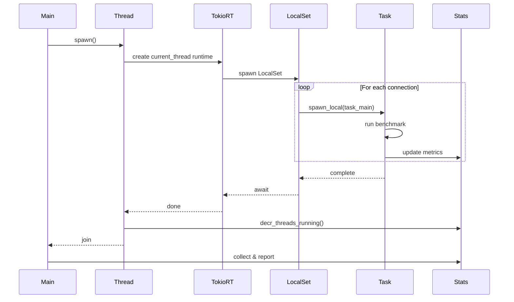

### Connection Abstraction

Two connection types are provided through a common trait:

1. **ValkeyClient** - Single-node connection
2. **ValkeyCluster** - Cluster-aware connection with slot routing

Both implement the `Connection` trait:

```rust
#[async_trait]
pub trait Connection {
    async fn send_request(&mut self, buffer: &[u8]) -> Result<BytesMut, CommonError>;
    async fn send_vecdb_ingest_request(&mut self, requests: Vec<BytesMut>) -> Result<Vec<BytesMut>, CommonError>;
}
```

### Cluster Architecture

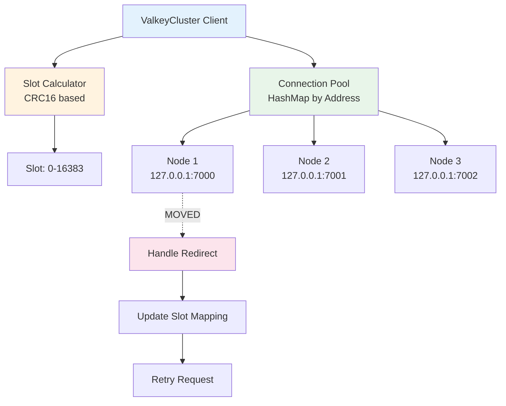

**Cluster Features:**
- Slot calculation using CRC16 (XMODEM variant)
- Hashtag support for key grouping
- Lazy connection establishment
- MOVED/ASK redirection handling
- Dynamic node discovery

## Protocol Architecture

### RESP Protocol Stack

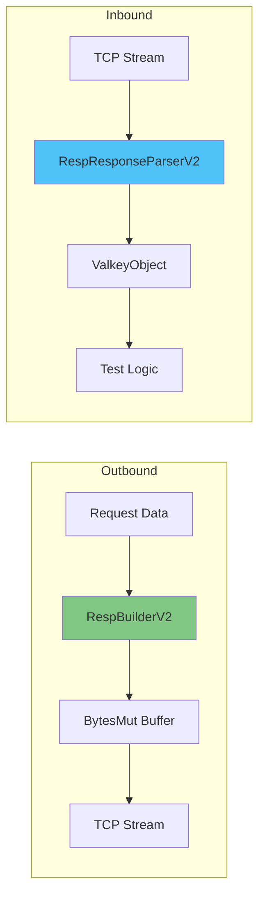

**Components:**
1. **RespBuilderV2** - Constructs RESP protocol messages
2. **RespResponseParserV2** - Parses RESP responses into structured objects
3. **ValkeyObject** - Enum representing RESP data types
4. **RequestParser** - Parses RESP requests (for slot calculation)

**Supported RESP Types:**
- Simple Strings (Status)
- Errors
- Integers
- Bulk Strings
- Arrays
- Null values

## Statistics & Monitoring Architecture

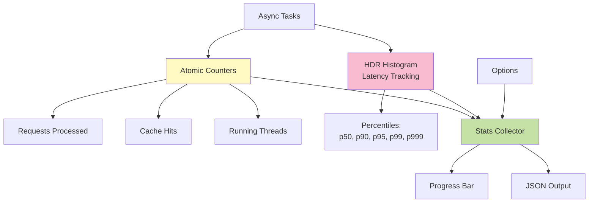

**Statistics Features:**
- Lock-free atomic counters for high-performance updates
- HDR histogram for accurate latency percentiles (100µs to 10 minutes range)
- Real-time progress bars using `indicatif`
- Optional JSON output for machine processing
- Per-test-type tracking (SET vs GET in setget mode)

## Data Flow

### Request Flow

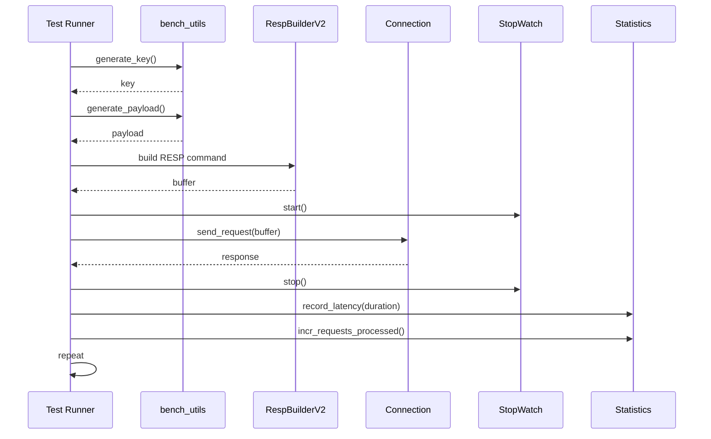

### Response Flow

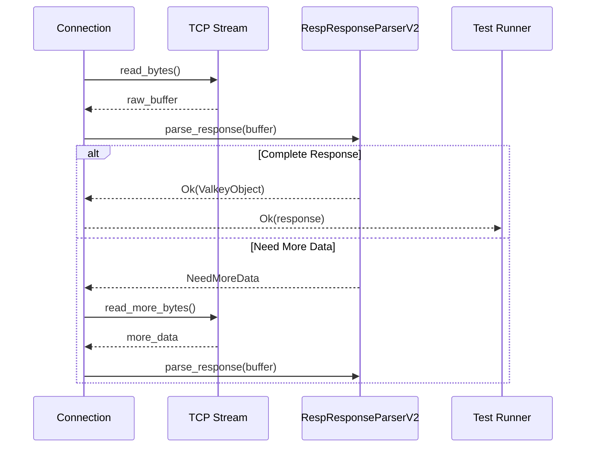

## Configuration Architecture

### Preset System

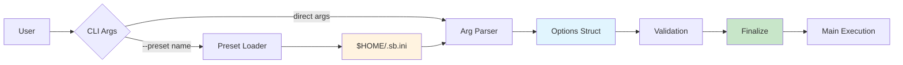

**Preset Features:**
- INI file format for easy editing
- Named presets for common scenarios
- Override capability with CLI args
- Stored in user home directory

## Error Handling Architecture

### Error Type Hierarchy

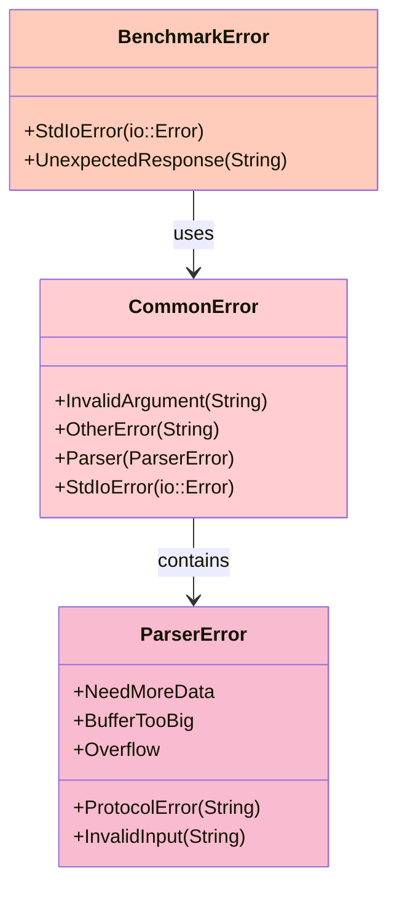

## Security Architecture

### TLS Support

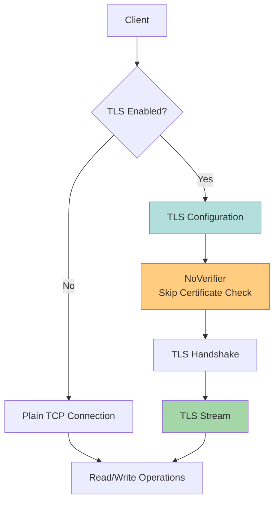

**Security Notes:**
- TLS certificate verification is intentionally bypassed for benchmarking
- Uses `tokio-rustls` for async TLS support
- Supports both `--tls` and `--ssl` flags

## Scalability Considerations

### Thread Scaling

- **Horizontal Scaling:** Add more threads (`--threads`)
- **Connection Scaling:** Increase connections (`--connections`)
- **Request Scaling:** Configure total requests (`--num-requests`)

### Optimization Strategies

1. **Current-thread Runtime:** Avoids thread synchronization overhead
2. **LocalSet:** Tasks don't migrate between threads
3. **Lock-free Statistics:** Atomic operations for counters
4. **Buffer Reuse:** BytesMut for efficient buffer management
5. **Release Profile:** LTO and single codegen unit

## Extension Points

### Adding New Tests

1. Implement test function in `tests.rs`:
   ```rust
   pub async fn run_mytest(
       conn: impl Connection,
       opts: Options,
       requests_count: usize
   ) -> Result<(), Box<dyn std::error::Error>>
   ```

2. Add test name to match statement in `task_main()` in `main.rs`

3. Update CLI help text in `sb_options.rs`

### Adding Protocol Extensions

1. Extend `ValkeyObject` enum in `resp_response_parser_v2.rs`
2. Update parser to handle new type
3. Update builder if needed for outbound messages

## Design Principles

1. **Separation of Concerns** - Protocol, transport, and business logic are distinct
2. **Async-First** - Built on Tokio for efficient I/O
3. **Zero-Copy Where Possible** - BytesMut avoids unnecessary allocations
4. **Fail-Fast** - Clear error types with thiserror
5. **Observability** - Comprehensive statistics and progress tracking
6. **Flexibility** - Configurable parameters for various workload patterns
7. **Performance** - Lock-free design, efficient protocols, optimized builds
