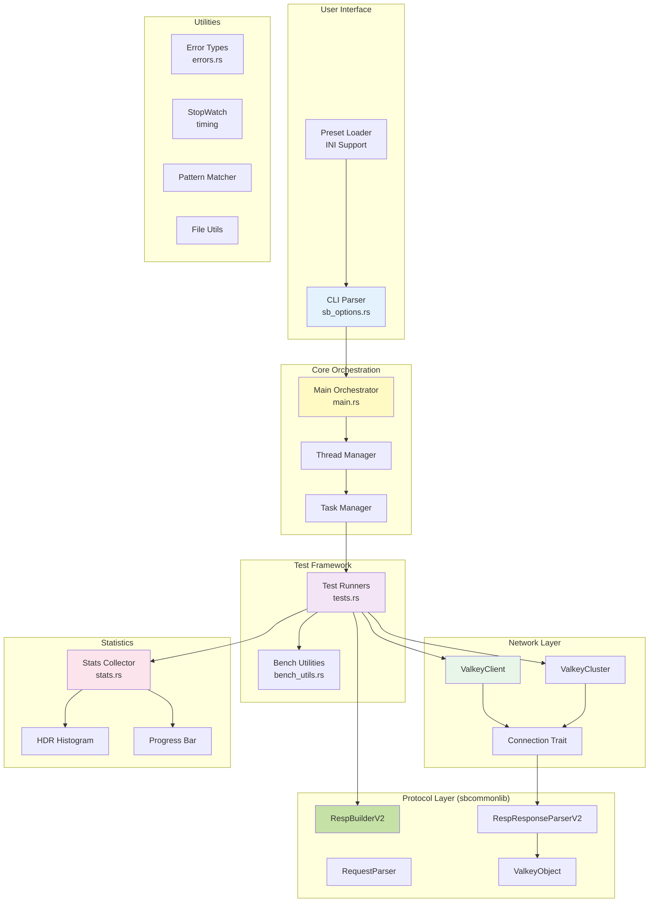
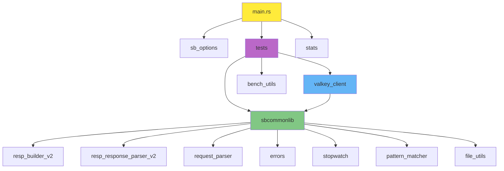

# Major Components

## Component Map



## Component Descriptions

### 1. CLI Parser (sb_options.rs)

**Purpose:** Parse command-line arguments and manage configuration

**Key Features:**
- Uses `clap` with derive macros for declarative CLI definition
- Supports preset loading from `~/.sb.ini`
- Validates and finalizes options
- JSON serialization support for output

**Public Interface:**
```rust
pub struct Options {
    pub connections: usize,
    pub threads: usize,
    pub host: String,
    pub port: usize,
    pub test: String,
    pub data_size: usize,
    pub key_size: Option<usize>,
    pub key_range: usize,
    pub num_requests: usize,
    pub pipeline: usize,
    pub tls: bool,
    pub randomize: bool,
    pub cluster: bool,
    // ... and more
}

impl Options {
    pub fn initialise() -> (Self, String);
    pub fn finalise(&mut self);
    pub fn client_requests(&self) -> usize;
    pub fn tasks_per_thread(&self) -> usize;
    pub fn get_key_size(&self) -> usize;
    pub fn get_log_level(&self) -> Level;
    pub fn get_setget_ratio(&self) -> Option<(f32, f32)>;
    pub fn tls_enabled(&self) -> bool;
}
```

**Responsibilities:**
- Command-line parsing
- INI file loading
- Option validation
- Calculated field generation (key size, requests per client)
- Log level conversion

---

### 2. Main Orchestrator (main.rs)

**Purpose:** Application entry point and high-level coordination

**Key Functions:**
```rust
fn main() -> Result<(), Box<dyn std::error::Error>>;
async fn thread_main(opts: Options) -> Result<(), Box<dyn std::error::Error>>;
async fn task_main(opts: Options, requests_count: usize) -> Result<(), Box<dyn std::error::Error>>;
```

**Responsibilities:**
- Initialize application (logging, statistics, signal handlers)
- Parse command-line arguments
- Spawn worker threads
- Coordinate test execution
- Wait for completion
- Report final statistics

**Special Handling:**
- SETGET test splits connections into separate SET and GET tasks
- Each thread manages a Tokio current-thread runtime
- Tasks run on LocalSet for performance

---

### 3. Test Runners (tests.rs)

**Purpose:** Implement benchmark tests for different Redis/Valkey commands

**Public Interface:**
```rust
pub async fn run_set(conn: impl Connection, opts: Options, requests_count: usize) -> Result<(), Box<dyn std::error::Error>>;
pub async fn run_get(conn: impl Connection, opts: Options, requests_count: usize) -> Result<(), Box<dyn std::error::Error>>;
pub async fn run_ping(conn: impl Connection, opts: Options) -> Result<(), Box<dyn std::error::Error>>;
pub async fn run_incr(conn: impl Connection, opts: Options) -> Result<(), Box<dyn std::error::Error>>;
pub async fn run_push(conn: impl Connection, is_right: bool, opts: Options) -> Result<(), Box<dyn std::error::Error>>;
pub async fn run_pop(conn: impl Connection, is_right: bool, opts: Options) -> Result<(), Box<dyn std::error::Error>>;
pub async fn run_hset(conn: impl Connection, opts: Options) -> Result<(), Box<dyn std::error::Error>>;
pub async fn run_vecdb_ingest(conn: impl Connection, opts: Options) -> Result<(), Box<dyn std::error::Error>>;
```

**Test Pattern:**
All tests follow a similar structure:
1. Generate keys/payloads using bench_utils
2. Build RESP command using RespBuilderV2
3. Start stopwatch
4. Send request via connection
5. Stop stopwatch and record latency
6. Validate response
7. Update statistics
8. Repeat for configured request count

**Response Validation Helpers:**
```rust
fn expect_ok(response: &ValkeyObject) -> Result<(), BenchmarkError>;
fn expect_pong(response: &ValkeyObject) -> Result<(), BenchmarkError>;
fn expect_string_or_null(response: &ValkeyObject) -> Result<bool, BenchmarkError>;
fn expect_integer(response: &ValkeyObject) -> Result<(), BenchmarkError>;
```

---

### 4. ValkeyClient (valkey_client.rs)

**Purpose:** Single-node Redis/Valkey connection implementation

**Structure:**
```rust
pub struct ValkeyClient {
    stream: StreamType,
    parser: RespResponseParserV2,
    leftover: BytesMut,
}

enum StreamType {
    Plain(TcpStream),
    Tls(TlsStream<TcpStream>),
}
```

**Key Methods:**
```rust
impl ValkeyClient {
    pub async fn connect(host: String, port: u16, use_tls: bool) -> Result<Self, CommonError>;
    async fn read_response(&mut self) -> Result<ValkeyObject, CommonError>;
}

#[async_trait]
impl Connection for ValkeyClient {
    async fn send_request(&mut self, buffer: &[u8]) -> Result<BytesMut, CommonError>;
    async fn send_vecdb_ingest_request(&mut self, requests: Vec<BytesMut>) -> Result<Vec<BytesMut>, CommonError>;
}
```

**Responsibilities:**
- TCP/TLS connection establishment
- Request sending
- Response reading and buffering
- Protocol parsing
- Pipeline support (send multiple, read multiple)

---

### 5. ValkeyCluster (valkey_client.rs)

**Purpose:** Cluster-aware Redis/Valkey connection with slot routing

**Structure:**
```rust
pub struct ValkeyCluster {
    connections: HashMap<String, ValkeyClient>,
    initial_host: String,
    initial_port: u16,
    use_tls: bool,
}
```

**Key Methods:**
```rust
impl ValkeyCluster {
    pub async fn connect(host: String, port: u16, use_tls: bool) -> Result<Self, CommonError>;
    async fn get_or_create_connection(&mut self, host: &str, port: u16) -> Result<&mut ValkeyClient, CommonError>;
    async fn send_to_node(&mut self, buffer: &[u8]) -> Result<(String, u16, BytesMut), CommonError>;
}

#[async_trait]
impl Connection for ValkeyCluster {
    async fn send_request(&mut self, buffer: &[u8]) -> Result<BytesMut, CommonError>;
    async fn send_vecdb_ingest_request(&mut self, requests: Vec<BytesMut>) -> Result<Vec<BytesMut>, CommonError>;
}
```

**Cluster Features:**
- **Slot Calculation:** CRC16-based slot calculation (0-16383)
- **Hashtag Support:** Extracts keys from `{tag}` patterns
- **Lazy Connection:** Creates connections to nodes on-demand
- **MOVED Handling:** Automatically retries on MOVED errors
- **Node Discovery:** Parses CLUSTER NODES to find all cluster members

**Helper Functions:**
```rust
pub fn calculate_slot(key: &[u8]) -> u16;
fn slot_from_buffer(buffer: &BytesMut) -> Result<Option<u16>, CommonError>;
fn parse_moved(errmsg: &str) -> Option<(u16, String, u16)>;
fn parse_cluster_nodes_line(line: &str) -> Option<(String, u16)>;
```

---

### 6. RespBuilderV2 (common/resp_builder_v2.rs)

**Purpose:** Build RESP protocol messages

**Structure:**
```rust
#[derive(Default, Clone)]
pub struct RespBuilderV2 {}
```

**Key Methods:**
```rust
impl RespBuilderV2 {
    pub fn bulk_string(&self, buffer: &mut BytesMut, content: &[u8]);
    pub fn ok(&self, buffer: &mut BytesMut);
    pub fn null_string(&self, buffer: &mut BytesMut);
    pub fn null_array(&self, buffer: &mut BytesMut);
    pub fn empty_string(&self, buffer: &mut BytesMut);
    pub fn empty_array(&self, buffer: &mut BytesMut);
    pub fn error_string(&self, buffer: &mut BytesMut, msg: &str);
    pub fn status_string(&self, buffer: &mut BytesMut, msg: &str);
    pub fn pong(&self, buffer: &mut BytesMut);
    pub fn add_array_len(&self, buffer: &mut BytesMut, len: usize);
    pub fn add_bulk_string(&self, buffer: &mut BytesMut, content: &[u8]);
    pub fn add_number_as_bulk_string<T>(&self, buffer: &mut BytesMut, number: T) where T: ToString;
    pub fn add_null_string(&self, buffer: &mut BytesMut);
}
```

**Usage Pattern:**
```rust
let builder = RespBuilderV2::default();
let mut buffer = BytesMut::new();
builder.add_array_len(&mut buffer, 3);
builder.add_bulk_string(&mut buffer, b"SET");
builder.add_bulk_string(&mut buffer, key);
builder.add_bulk_string(&mut buffer, value);
// buffer now contains: *3\r\n$3\r\nSET\r\n$4\r\nkey1\r\n$5\r\nvalue\r\n
```

---

### 7. RespResponseParserV2 (common/resp_response_parser_v2.rs)

**Purpose:** Parse RESP protocol responses

**Structure:**
```rust
#[derive(Default)]
pub struct RespResponseParserV2 {}

#[derive(PartialEq, Eq, Debug)]
pub enum ResponseParseResult {
    NeedMoreData,
    Ok((usize, ValkeyObject)),
}

#[derive(PartialEq, Eq, Debug, Clone)]
pub enum ValkeyObject {
    Status(BytesMut),
    Error(BytesMut),
    Str(BytesMut),
    Array(Vec<ValkeyObject>),
    NullArray,
    NullString,
    Integer(u64),
}
```

**Key Methods:**
```rust
impl RespResponseParserV2 {
    pub fn parse_response(buffer: &[u8]) -> Result<ResponseParseResult, CommonError>;
}

impl ValkeyObject {
    pub fn integer(&self) -> Result<u64, CommonError>;
    pub fn status(&self) -> Result<BytesMut, CommonError>;
    pub fn string(&self) -> Result<BytesMut, CommonError>;
    pub fn error_string(&self) -> Result<BytesMut, CommonError>;
    pub fn array(&self) -> Result<Vec<ValkeyObject>, CommonError>;
    pub fn is_null_string(&self) -> bool;
}
```

**Parsing Strategy:**
- Examines first byte to determine type (+, -, :, $, *)
- Returns `NeedMoreData` if incomplete
- Returns `Ok((bytes_consumed, object))` on success
- Handles nested arrays recursively

---

### 8. Statistics Collector (stats.rs)

**Purpose:** Collect and aggregate performance metrics

**Structure:**
```rust
lazy_static! {
    static ref REQUESTS_PROCESSED: AtomicUsize;
    static ref HITS: AtomicUsize;
    static ref RUNNING_THREADS: AtomicUsize;
    static ref HIST: Mutex<Histogram<u64>>;
    static ref PROGRESS: ProgressBar;
}

#[derive(Serialize, Debug, Default)]
pub struct Stats {
    test_duration_secs: usize,
    total_connections: usize,
    total_threads: usize,
    total_requests: usize,
    total_hits: usize,
    key_size: usize,
    value_size: usize,
    rps: usize,
    pipeline: usize,
    latency_ms: Latency,
    options: Options,
}

#[derive(Serialize, Debug, Default)]
pub struct Latency {
    pmin: f64,
    p50: f64,
    p90: f64,
    p95: f64,
    p99: f64,
    p995: f64,
    p999: f64,
    pmax: f64,
}
```

**Key Functions:**
```rust
pub fn incr_requests_processed(count: usize);
pub fn incr_hits(count: usize);
pub fn record_latency(micros: u64);
pub fn requests_processed() -> usize;
pub fn total_hits() -> usize;
pub fn finalise_progress_setup(total: u64);
pub fn update_progress(count: u64);
pub fn finish_progress();
impl Stats {
    pub fn collect(opts: &Options, test_duration_millis: f64) -> Self;
}
```

**Design Notes:**
- Uses atomic operations for lock-free updates from multiple threads
- HDR histogram provides accurate latency percentiles
- Supports both terminal progress bars and JSON output

---

### 9. Bench Utilities (bench_utils.rs)

**Purpose:** Generate test data and keys

**Key Functions:**
```rust
pub fn generate_payload(len: usize) -> BytesMut;
pub fn generate_key(len: usize, key_range: usize) -> BytesMut;
pub fn set_randomize_keys(random: bool);
pub fn generate_vector(dim: usize) -> String;
```

**Key Generation Strategies:**
1. **Sequential Mode** (default): Incrementing counter (0, 1, 2, ...)
2. **Random Mode** (--randomize): Random numbers in range

**Implementation Details:**
- Uses global atomic counter for sequential keys
- Zero-pads keys to requested length
- Wraps around when reaching key_range
- Vector generation creates hex-encoded f32 arrays

---

### 10. Error Types (common/errors.rs)

**Purpose:** Define error types for the application

**Structure:**
```rust
#[derive(Error, Debug, PartialEq, Eq)]
pub enum ParserError {
    #[error("Need more to data to complete operation")]
    NeedMoreData,
    #[error("Protocol error. `{0}`")]
    ProtocolError(String),
    #[error("Input too big")]
    BufferTooBig,
    #[error("Overflow occurred")]
    Overflow,
    #[error("Invalid input. {0}")]
    InvalidInput(String),
}

#[derive(Error, Debug)]
pub enum CommonError {
    #[error("Invalid argument error. {0}")]
    InvalidArgument(String),
    #[error("Error. {0}")]
    OtherError(String),
    #[error("Parse error. {0}")]
    Parser(#[from] ParserError),
    #[error("I/O error. {0}")]
    StdIoError(#[from] std::io::Error),
}
```

---

### 11. StopWatch (common/stopwatch.rs)

**Purpose:** High-precision timing for latency measurement

**Usage Pattern:**
```rust
let sw = StopWatch::default();
sw.start();
// ... perform operation
sw.stop();
let micros = sw.elapsed_micros();
stats::record_latency(micros);
```

---

### 12. Pattern Matcher (common/pattern_matcher.rs)

**Purpose:** Wildcard pattern matching for keys/commands

**Features:**
- Supports glob-style patterns
- Used for filtering commands or keys in tests

---

### 13. Request Parser (common/request_parser.rs)

**Purpose:** Parse RESP requests (for slot calculation in cluster mode)

**Usage:**
- Extracts command and arguments from RESP array
- Used to determine which key to use for slot calculation

---

### 14. TLS Support

**Purpose:** Enable encrypted connections

**Components:**
- `NoVerifier` struct that bypasses certificate validation
- `StreamType` enum to handle both plain and TLS streams
- Uses `tokio-rustls` for async TLS

**Security Note:** Certificate verification is intentionally disabled for benchmarking purposes.

---

## Component Dependencies



## Component Communication Patterns

### Synchronous Communication
- CLI parsing and validation
- Statistics collection via atomic operations

### Asynchronous Communication
- All network I/O operations
- Test execution
- Task spawning and coordination

### Shared State
- Global statistics (thread-safe via atomics)
- Configuration (cloned per thread/task)
- Connection pools (ValkeyCluster)

## Extensibility Points

1. **New Test Types:** Add functions in `tests.rs` and update `task_main()`
2. **New RESP Types:** Extend `ValkeyObject` enum and parser
3. **New Statistics:** Add atomic counters or histogram tracking
4. **Custom Protocols:** Implement `Connection` trait for new backends
5. **Output Formats:** Extend `Stats` serialization
