# External Dependencies

## Dependency Overview

The project uses Cargo workspace with two members: `sbcommonlib` (common library) and `sb` (main benchmark application).

## sbcommonlib Dependencies

**Cargo.toml:** `common/Cargo.toml`

| Crate | Version | Features | Purpose |
|-------|---------|----------|---------|
| `bytes` | 1 | - | Efficient byte buffer management |
| `clap` | 4 | derive | Command-line argument parsing (re-exported) |
| `test-case` | 3 | - | Parameterized testing |
| `tracing` | 0 | log | Logging framework |
| `rand` | 0 | - | Random number generation |
| `thiserror` | 1 | - | Ergonomic error type derivation |
| `wildmatch` | 2 | - | Wildcard pattern matching |

---

## sb (Main Application) Dependencies

**Cargo.toml:** `sabledb-benchmark/Cargo.toml`

| Crate | Version | Features | Purpose |
|-------|---------|----------|---------|
| `sbcommonlib` | - | - | Local workspace dependency |
| `clap` | 4 | derive | CLI argument parsing |
| `tracing` | 0 | log | Logging infrastructure |
| `tracing-subscriber` | 0 | - | Tracing output formatting |
| `ctrlc` | 3.4.0 | - | Ctrl+C signal handling |
| `tokio` | 1 | full | Async runtime |
| `futures` | 0.3 | - | Async combinators |
| `bytes` | 1 | - | Byte buffer management |
| `rand` | 0 | - | Random generation |
| `lazy_static` | 1 | - | Static initialization |
| `indicatif` | 0.17.7 | - | Progress bars |
| `hdrhistogram` | 7.5.4 | - | High dynamic range histogram |
| `tokio-rustls` | 0 | - | Async TLS support |
| `rustls` | 0 | default-features=false | TLS library |
| `webpki-roots` | 0 | - | CA certificate bundle |
| `pki-types` | 1 | - | TLS PKI types (alias: rustls-pki-types) |
| `test-case` | 3 | - | Parameterized tests |
| `num-format` | 0 | - | Number formatting |
| `rclite` | 0.2.4 | - | Reference-counted utilities |
| `rust-ini` | 0.20.0 | - | INI file parsing |
| `colored` | 2 | - | Terminal color output |
| `thiserror` | 1 | - | Error type derivation |
| `hex` | 0.4.3 | - | Hex encoding/decoding |
| `async-trait` | 0 | - | Async trait support |
| `crc16` | 0.4.0 | - | CRC16 checksum (for cluster slots) |
| `serde` | 1.0 | derive | Serialization framework |
| `serde_json` | 1.0 | - | JSON serialization |

---

## Detailed Dependency Analysis

### Core Runtime: tokio

**Version:** 1.x  
**Features:** `full`

**Purpose:**
- Async runtime for concurrent I/O
- TCP stream handling
- Task spawning and management
- Timer functionality

**Usage Areas:**
- Connection establishment (`TcpStream::connect`)
- Async read/write operations
- Runtime creation in worker threads
- LocalSet for task execution

**Key APIs Used:**
```rust
tokio::net::TcpStream
tokio::runtime::Builder::new_current_thread()
tokio::task::LocalSet
tokio::io::{AsyncReadExt, AsyncWriteExt}
```

---

### Networking: tokio-rustls / rustls

**Versions:**
- `tokio-rustls`: latest (0.x)
- `rustls`: latest with default features disabled
- `webpki-roots`: latest
- `pki-types` (rustls-pki-types): 1.x

**Purpose:**
- TLS encryption for secure connections
- Certificate handling
- Async TLS streams

**Usage Areas:**
- Optional TLS connection mode
- Custom certificate verifier (bypasses validation)
- TLS handshake with servers

**Key APIs Used:**
```rust
use tokio_rustls::{TlsConnector, client::TlsStream};
use rustls::{ClientConfig, ServerCertVerifier};
use pki_types::{CertificateDer, ServerName, UnixTime};
```

**Security Note:** Uses custom `NoVerifier` that skips certificate validation for benchmarking purposes.

---

### Data Management: bytes

**Version:** 1.x

**Purpose:**
- Efficient byte buffer manipulation
- Zero-copy operations where possible
- Reference-counted buffer sharing

**Usage Areas:**
- RESP protocol message construction
- Network read/write buffers
- Response accumulation
- Key and value storage

**Key APIs Used:**
```rust
use bytes::BytesMut;

BytesMut::new()
BytesMut::with_capacity()
BytesMut::from()
buffer.extend_from_slice()
buffer.advance()
buffer.clear()
```

---

### CLI Parsing: clap

**Version:** 4.x  
**Features:** `derive`

**Purpose:**
- Declarative command-line argument parsing
- Help text generation
- Argument validation
- Type conversion

**Usage Areas:**
- Main application options
- Preset command handling
- Help message display

**Key APIs Used:**
```rust
use clap::Parser;

#[derive(Parser, Debug, Clone)]
struct Options {
    #[arg(short, long, default_value = "512")]
    connections: usize,
    // ...
}
```

---

### Statistics: hdrhistogram

**Version:** 7.5.4

**Purpose:**
- High dynamic range histogram for latency tracking
- Accurate percentile calculation
- Efficient memory usage

**Usage Areas:**
- Latency measurement storage
- Percentile calculation (p50, p90, p95, p99, p99.5, p99.9)

**Configuration:**
- Range: 1µs to 600,000,000µs (10 minutes)
- Precision: 2 significant figures

**Key APIs Used:**
```rust
use hdrhistogram::Histogram;

let hist = Histogram::<u64>::new_with_bounds(1, 600000000, 2)?;
hist.record(latency_micros)?;
hist.value_at_quantile(0.99)
hist.min()
hist.max()
```

---

### Progress Display: indicatif

**Version:** 0.17.7

**Purpose:**
- Terminal progress bars
- Real-time operation status
- Completion percentage display

**Usage Areas:**
- Request completion tracking
- Visual feedback during benchmarks

**Key APIs Used:**
```rust
use indicatif::ProgressBar;

let pb = ProgressBar::new(total_requests);
pb.inc(1);
pb.finish();
```

---

### Logging: tracing / tracing-subscriber

**Versions:**
- `tracing`: latest with `log` feature
- `tracing-subscriber`: latest

**Purpose:**
- Structured logging
- Debug output
- Error tracking

**Usage Areas:**
- Application diagnostics
- Error logging
- Debug information

**Configuration:**
```rust
use tracing_subscriber;

tracing_subscriber::fmt()
    .with_thread_names(true)
    .with_thread_ids(true)
    .with_max_level(level)
    .init();
```

**Log Levels:** error, warn, info, debug, trace

---

### Configuration: rust-ini

**Version:** 0.20.0

**Purpose:**
- INI file parsing
- Preset configuration loading

**Usage Areas:**
- `~/.sb.ini` preset loading
- Configuration storage

**Key APIs Used:**
```rust
use ini::Ini;

let conf = Ini::load_from_file(path)?;
let section = conf.section(Some("preset-name"))?;
```

---

### Error Handling: thiserror

**Version:** 1.x

**Purpose:**
- Ergonomic error type definitions
- Automatic Display implementation
- Error conversion traits

**Usage Areas:**
- CommonError definition
- ParserError definition
- BenchmarkError definition

**Key APIs Used:**
```rust
use thiserror::Error;

#[derive(Error, Debug)]
pub enum CommonError {
    #[error("Invalid argument error. {0}")]
    InvalidArgument(String),
    #[error("Parse error. {0}")]
    Parser(#[from] ParserError),
}
```

---

### Serialization: serde / serde_json

**Versions:**
- `serde`: 1.0 with `derive` feature
- `serde_json`: 1.0

**Purpose:**
- JSON output generation
- Configuration serialization

**Usage Areas:**
- Statistics output in JSON format
- Options serialization

**Key APIs Used:**
```rust
use serde::{Serialize, Deserialize};
use serde_json;

#[derive(Serialize)]
struct Stats { ... }

let json = serde_json::to_string_pretty(&stats)?;
```

---

### Random Generation: rand

**Version:** Latest (0.x)

**Purpose:**
- Random key generation
- Random payload generation
- Random vector generation

**Usage Areas:**
- Key generation in random mode
- Payload data creation
- Vector DB test data

**Key APIs Used:**
```rust
use rand::prelude::*;
use rand::distr::{Alphanumeric, Uniform};

let rng = rand::rng();
let random_num: u64 = rng.random();
let chars: String = rng.sample_iter(&Alphanumeric).take(n).collect();
```

---

### Terminal Output: colored

**Version:** 2.x

**Purpose:**
- Colored terminal text
- Emphasis and formatting

**Usage Areas:**
- Status messages
- Configuration display
- Error highlighting

**Key APIs Used:**
```rust
use colored::Colorize;

println!("{}", "Success".bold().green());
println!("{}", "Error".red());
```

---

### Numeric Formatting: num-format

**Version:** Latest (0.x)

**Purpose:**
- Number formatting with thousands separators
- Locale-aware formatting

**Usage Areas:**
- Statistics display
- Human-readable output

**Key APIs Used:**
```rust
use num_format::{Locale, ToFormattedString};

let formatted = number.to_formatted_string(&Locale::en);
```

---

### Cluster Support: crc16

**Version:** 0.4.0

**Purpose:**
- CRC16 checksum calculation
- Redis cluster slot calculation

**Usage Areas:**
- Hash slot determination (0-16383)
- Key routing in cluster mode

**Key APIs Used:**
```rust
use crc16;

let crc = crc16::State::<crc16::XMODEM>::calculate(key);
let slot = crc % 16384;
```

**Algorithm:** XMODEM variant of CRC16

---

### Signal Handling: ctrlc

**Version:** 3.4.0

**Purpose:**
- Ctrl+C signal interception
- Graceful shutdown handling

**Usage Areas:**
- User interrupt handling
- Shutdown coordination

**Key APIs Used:**
```rust
use ctrlc;

ctrlc::set_handler(move || {
    std::process::exit(0);
})?;
```

---

### Utility Dependencies

#### lazy_static

**Version:** 1.x

**Purpose:** Static variable initialization with runtime values

**Usage:**
- Global statistics counters
- Shared histograms
- Preset configuration storage

```rust
lazy_static! {
    static ref COUNTER: AtomicUsize = AtomicUsize::new(0);
}
```

#### async-trait

**Version:** Latest (0.x)

**Purpose:** Async methods in traits

**Usage:**
- `Connection` trait definition
- Async trait implementations

```rust
#[async_trait]
pub trait Connection {
    async fn send_request(&mut self, buffer: &[u8]) -> Result<BytesMut, CommonError>;
}
```

#### hex

**Version:** 0.4.3

**Purpose:** Hexadecimal encoding/decoding

**Usage:**
- Vector DB vector encoding
- Binary data representation

```rust
use hex;

let hex_string = hex::encode(&bytes);
```

#### wildmatch

**Version:** 2.x

**Purpose:** Glob-style pattern matching

**Usage:**
- Pattern matching in common library
- Command/key filtering

#### test-case

**Version:** 3.x

**Purpose:** Parameterized test macros

**Usage:**
- Unit test parameterization
- Test case generation

```rust
use test_case::test_case;

#[test_case(1, 2, 3)]
#[test_case(4, 5, 9)]
fn test_addition(a: i32, b: i32, expected: i32) {
    assert_eq!(a + b, expected);
}
```

#### rclite

**Version:** 0.2.4

**Purpose:** Reference-counted utilities

**Usage:** Lightweight reference counting (specific usage not prominent in examined code)

---

## Build Dependencies

### Windows-Specific: pthread

**Platform:** Windows only

**Build Script:** `sabledb-benchmark/build.rs`

```rust
#[cfg(target_os = "windows")]
fn main() {
    println!("cargo:rustc-link-lib=pthread");
}
```

**Purpose:** Link against pthread library for Windows builds

---

## Dependency Graph

```mermaid
graph TB
    subgraph "sb Binary"
        SB[sb main]
    end
    
    subgraph "Internal Dependencies"
        SB --> Common[sbcommonlib]
    end
    
    subgraph "Core Runtime"
        SB --> Tokio[tokio]
        SB --> Futures[futures]
    end
    
    subgraph "Networking"
        SB --> TokioRustls[tokio-rustls]
        TokioRustls --> Rustls[rustls]
        Rustls --> WebpkiRoots[webpki-roots]
        Rustls --> PkiTypes[pki-types]
    end
    
    subgraph "CLI & Config"
        SB --> Clap[clap]
        Common --> Clap
        SB --> RustIni[rust-ini]
    end
    
    subgraph "Data & Buffers"
        SB --> Bytes[bytes]
        Common --> Bytes
    end
    
    subgraph "Statistics"
        SB --> HDR[hdrhistogram]
        SB --> Indicatif[indicatif]
    end
    
    subgraph "Serialization"
        SB --> Serde[serde]
        SB --> SerdeJson[serde_json]
    end
    
    subgraph "Logging"
        SB --> Tracing[tracing]
        Common --> Tracing
        SB --> TracingSub[tracing-subscriber]
    end
    
    subgraph "Error Handling"
        SB --> Thiserror[thiserror]
        Common --> Thiserror
    end
    
    subgraph "Utilities"
        SB --> Rand[rand]
        Common --> Rand
        SB --> Colored[colored]
        SB --> NumFormat[num-format]
        SB --> CtrlC[ctrlc]
        SB --> Hex[hex]
        SB --> CRC16[crc16]
        SB --> AsyncTrait[async-trait]
        SB --> LazyStatic[lazy_static]
        SB --> RcLite[rclite]
        Common --> Wildmatch[wildmatch]
    end
    
    subgraph "Testing"
        SB --> TestCase[test-case]
        Common --> TestCase
    end
    
    style SB fill:#ffeb3b
    style Common fill:#81c784
    style Tokio fill:#64b5f6
    style Bytes fill:#ba68c8
```



---

## Version Management

### Workspace Configuration

**Root Cargo.toml:**
```toml
[workspace]
members = ["common", "sabledb-benchmark"]
resolver = "2"

[profile.release]
lto = true                 # Link-time optimization
codegen-units = 1          # Single codegen unit
strip = "symbols"          # Strip debug symbols
```

**Dependency Version Strategy:**
- Most dependencies use latest compatible version (0, 1, 2, etc.)
- Allows automatic minor/patch updates
- Pinned versions for specific compatibility (e.g., `indicatif 0.17.7`)

---

## Security Considerations

### TLS Certificate Verification

**Status:** **DISABLED FOR BENCHMARKING**

The application uses a custom `NoVerifier` that bypasses all certificate validation:

```rust
#[derive(Debug)]
struct NoVerifier;

impl ServerCertVerifier for NoVerifier {
    fn verify_server_cert(
        &self,
        _end_entity: &CertificateDer<'_>,
        _intermediates: &[CertificateDer<'_>],
        _server_name: &ServerName<'_>,
        _ocsp: &[u8],
        _now: UnixTime,
    ) -> Result<ServerCertVerified, TLSError> {
        Ok(ServerCertVerified::assertion())
    }
    // ... other methods also bypass verification
}
```

**Rationale:** Benchmarking tool prioritizes performance over security validation

**Warning:** This configuration should **NOT** be used in production applications

---

## Platform-Specific Dependencies

### Windows
- `pthread` library linked via build script

### All Platforms
- No other platform-specific dependencies
- Rust standard library handles cross-platform abstractions

---

## Testing Dependencies

### test-case

Used in both workspaces for parameterized tests

**Example Usage:**
```rust
#[test_case(1.0, 2.0, 3.0)]
#[test_case(4.0, 5.0, 9.0)]
fn test_vector_generation(a: f32, b: f32, c: f32) {
    let v = vec![a, b, c];
    // test logic
}
```

---

## Dependency Maintenance

### Update Strategy
- Use `cargo update` for patch version updates
- Review breaking changes for major version updates
- Test thoroughly after dependency updates

### Known Compatibility
- Rust Edition: 2021
- MSRV (Minimum Supported Rust Version): Not explicitly specified, but uses recent Rust features

### Dependency Audit
Recommended tools:
- `cargo audit` - Check for known security vulnerabilities
- `cargo outdated` - Check for available updates
- `cargo tree` - Visualize dependency tree

---

## Performance-Critical Dependencies

### High-Performance Requirements

1. **tokio** - Async runtime performance critical for I/O
2. **bytes** - Zero-copy operations essential for protocol handling
3. **hdrhistogram** - Efficient latency tracking without overhead
4. Atomic operations (std::sync::atomic) - Lock-free statistics

### Optimization Notes

- Release profile enables LTO and single codegen unit
- BytesMut usage avoids unnecessary allocations
- Atomic counters eliminate lock contention
- Current-thread runtime reduces scheduling overhead
