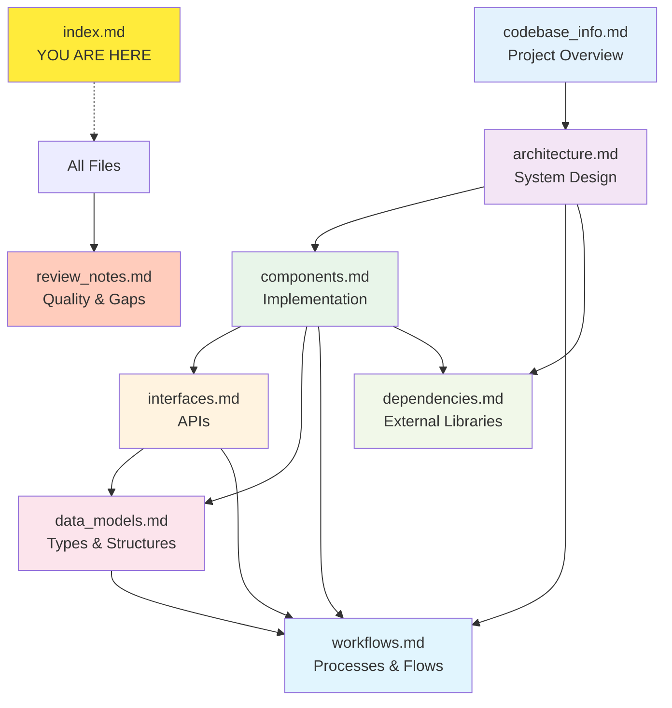

# Knowledge Base Index for sb (SableDB Benchmark)

## 🤖 Instructions for AI Assistants

This knowledge base provides comprehensive documentation about the `sb` benchmark tool codebase. This index file serves as your **primary entry point** for understanding the project. Use the metadata and summaries below to quickly locate relevant information for specific questions or tasks.

### How to Use This Knowledge Base

1. **Start Here:** This index contains rich metadata about each documentation file
2. **Quick Navigation:** Use the summaries to identify which files are relevant to your question
3. **Targeted Reading:** Only read the full documentation files that are relevant to your current task
4. **Cross-References:** Follow relationships between files when you need deeper understanding

### Quick Reference Map

```
Question Type → Relevant File(s)
├─ "What does this project do?" → codebase_info.md
├─ "How is the system designed?" → architecture.md
├─ "What are the main modules?" → components.md
├─ "How do I use/call this API?" → interfaces.md
├─ "What data structures exist?" → data_models.md
├─ "How does feature X work?" → workflows.md
├─ "What libraries are used?" → dependencies.md
└─ "Are there any issues?" → review_notes.md
```

---

## 📚 Documentation Files

### 1. codebase_info.md

**Purpose:** High-level project overview and basic information

**Contains:**
- Project name, type, and purpose
- Repository structure and directory layout
- Technology stack (Rust, Cargo workspace)
- List of all workspace members
- Supported test types and features
- Build configuration
- Key metrics and statistics

**Use This File When:**
- You need a quick overview of the project
- You want to understand the directory structure
- You're looking for what technologies/languages are used
- You need to know what test types are supported
- You want basic repository statistics

**Key Topics:**
- Project metadata
- Directory structure
- Rust workspace composition
- Feature list
- Build system configuration

**Relationships:**
- Provides context for all other documentation files
- Referenced by: architecture.md, components.md
- Foundation for understanding the codebase structure

---

### 2. architecture.md

**Purpose:** System architecture, design patterns, and structural relationships

**Contains:**
- Multi-layered architecture design
- Concurrent task model with Mermaid diagrams
- Thread and task orchestration patterns
- Connection abstractions (single-node vs cluster)
- Protocol architecture (RESP v2)
- Statistics and monitoring architecture
- Data flow diagrams
- Configuration and error handling architecture
- Security architecture (TLS)
- Scalability considerations
- Extension points

**Use This File When:**
- You need to understand how the system is structured
- You're working on concurrency or performance issues
- You want to know how components interact
- You need to understand the protocol layer
- You're adding new features and need to know extension points
- You're debugging connection or cluster-related issues

**Key Topics:**
- Layered architecture patterns
- Thread pool and async task model
- Connection abstractions (ValkeyClient, ValkeyCluster)
- RESP protocol stack
- Statistics collection architecture
- Cluster slot routing
- TLS integration

**Relationships:**
- Builds on: codebase_info.md
- Complements: components.md (architecture vs implementation)
- Referenced by: workflows.md (execution flows)

---

### 3. components.md

**Purpose:** Detailed documentation of major components and modules

**Contains:**
- Component map with visual diagram
- Detailed description of each major component:
  - CLI Parser (sb_options.rs)
  - Main Orchestrator (main.rs)
  - Test Runners (tests.rs)
  - ValkeyClient & ValkeyCluster
  - RESP Protocol handlers
  - Statistics Collector
  - Bench Utilities
  - Error Types
  - StopWatch and utilities
- Public interfaces for each component
- Component responsibilities
- Usage patterns
- Component dependencies

**Use This File When:**
- You need detailed information about a specific module
- You want to understand component responsibilities
- You're looking for specific functions or methods
- You need to know how to use a particular component
- You're modifying or extending existing components

**Key Topics:**
- CLI argument parsing
- Test execution framework
- Network clients (single-node and cluster)
- Protocol builders and parsers
- Statistics collection
- Utility functions
- Error handling

**Relationships:**
- Implements: architecture.md patterns
- Uses types from: data_models.md
- Provides APIs documented in: interfaces.md
- Workflows described in: workflows.md

---

### 4. interfaces.md

**Purpose:** Public APIs, interfaces, and integration points

**Contains:**
- Command-line interface (CLI) specification
- Configuration file format (INI)
- Connection trait definition
- ValkeyClient and ValkeyCluster APIs
- RESP protocol builder API
- RESP protocol parser API
- Statistics collection API
- Benchmark utilities API
- Test runner interfaces
- Error handling interfaces
- Output formats (human-readable and JSON)
- External integration points

**Use This File When:**
- You need to know CLI options and flags
- You want to understand API signatures
- You're integrating with external systems
- You need to know input/output formats
- You're writing code that calls these APIs
- You want to understand configuration options

**Key Topics:**
- Command-line options and usage
- Configuration file structure
- Trait definitions and implementations
- API method signatures
- RESP protocol wire format
- Statistics and output APIs
- Error types and handling

**Relationships:**
- Documents APIs from: components.md
- Uses types from: data_models.md
- Referenced by: workflows.md (API usage)
- Complements: architecture.md (interface vs design)

---

### 5. data_models.md

**Purpose:** Data structures, types, and models used throughout the codebase

**Contains:**
- Options (configuration) structure
- ValkeyObject (RESP data types)
- ResponseParseResult
- Statistics structures (Stats, Latency)
- Connection models (ValkeyClient, ValkeyCluster)
- Error model hierarchy
- Request/command models
- Timing models (StopWatch)
- Protocol buffer models (BytesMut)
- Cluster models (slot calculation, MOVED errors)
- Data flow models
- Memory management strategies
- Serialization models
- Constants and type aliases

**Use This File When:**
- You need to understand data structure definitions
- You're working with specific types
- You need to know field names and types
- You're implementing serialization/deserialization
- You want to understand error types
- You need to know data relationships

**Key Topics:**
- Struct and enum definitions
- Field descriptions
- Type relationships
- Serialization formats
- Error hierarchies
- Protocol data types
- Buffer management

**Relationships:**
- Types used by: components.md
- APIs defined in: interfaces.md
- Flows use these types: workflows.md
- Referenced throughout all documentation

---

### 6. workflows.md

**Purpose:** Step-by-step processes, flows, and operational sequences

**Contains:**
- Application lifecycle (startup, execution, shutdown)
- Thread orchestration workflow
- Task execution workflow
- Connection establishment (single-node and cluster)
- Benchmark test execution patterns
- RESP protocol communication flows
- Cluster request routing
- Statistics collection workflow
- Pipeline execution
- Error handling flow
- Graceful shutdown
- Preset loading
- Vector DB ingestion
- Common patterns and examples

**Use This File When:**
- You need to understand how a process works end-to-end
- You're debugging execution flow issues
- You want to see sequence diagrams
- You need to understand timing and ordering
- You're tracing through code execution
- You want to see example usage patterns

**Key Topics:**
- Startup and initialization
- Thread and task lifecycle
- Connection establishment
- Request-response cycles
- Cluster routing
- Statistics recording
- Error propagation
- Common code patterns

**Relationships:**
- Orchestrates: components.md
- Uses APIs from: interfaces.md
- Manipulates: data_models.md
- Implements: architecture.md patterns

---

### 7. dependencies.md

**Purpose:** External libraries, versions, and dependency relationships

**Contains:**
- Complete dependency list for both workspace members
- Detailed analysis of major dependencies:
  - tokio (async runtime)
  - bytes (buffer management)
  - clap (CLI parsing)
  - hdrhistogram (latency tracking)
  - tokio-rustls/rustls (TLS)
  - serde/serde_json (serialization)
  - And many more...
- Purpose and usage for each dependency
- Key APIs used from dependencies
- Version information
- Dependency graph
- Security considerations (TLS verification disabled)
- Platform-specific dependencies
- Performance-critical dependencies

**Use This File When:**
- You need to know what external libraries are used
- You're investigating dependency-related issues
- You want to update dependencies
- You need to understand why a library was chosen
- You're looking for security considerations
- You need to know version requirements

**Key Topics:**
- Runtime dependencies
- Build dependencies
- Version management
- Dependency purposes
- API usage examples
- Security notes
- Platform differences

**Relationships:**
- Used by: all components
- Provides foundation for: architecture.md
- External to but essential for: all other files

---

### 8. review_notes.md

**Purpose:** Documentation quality review, identified gaps, and recommendations

**Contains:**
- Consistency check results
- Completeness check results
- Identified gaps in documentation
- Areas lacking detail
- Recommendations for improvement
- Known limitations
- Future enhancements

**Use This File When:**
- You want to know documentation quality
- You're looking for known issues or gaps
- You need to improve documentation
- You want to understand limitations
- You're planning enhancements

**Key Topics:**
- Documentation gaps
- Areas needing expansion
- Consistency issues
- Improvement recommendations

**Relationships:**
- Reviews: all other documentation files
- Identifies improvements needed across knowledge base

---

## 🎯 Quick Navigation Guide

### By Task Type

#### Understanding the Project
1. Start with: **codebase_info.md**
2. Then read: **architecture.md**
3. For details: **components.md**

#### Adding a New Test Type
1. Read: **components.md** (Test Runners section)
2. Understand: **workflows.md** (Test execution workflow)
3. Reference: **interfaces.md** (Test runner interface)
4. Check: **architecture.md** (Extension points)

#### Debugging Connection Issues
1. Start: **components.md** (ValkeyClient/ValkeyCluster)
2. Flow: **workflows.md** (Connection establishment)
3. Details: **architecture.md** (Connection architecture)
4. Types: **data_models.md** (Connection models)

#### Working with RESP Protocol
1. Components: **components.md** (RespBuilderV2, RespResponseParserV2)
2. Architecture: **architecture.md** (Protocol architecture)
3. Types: **data_models.md** (ValkeyObject)
4. Flows: **workflows.md** (RESP communication)
5. API: **interfaces.md** (RESP APIs)

#### Understanding Cluster Mode
1. Architecture: **architecture.md** (Cluster architecture)
2. Components: **components.md** (ValkeyCluster)
3. Workflows: **workflows.md** (Cluster routing)
4. Data: **data_models.md** (Cluster models)

#### Modifying CLI Options
1. Interfaces: **interfaces.md** (CLI specification)
2. Components: **components.md** (CLI Parser)
3. Data: **data_models.md** (Options structure)

#### Performance Optimization
1. Architecture: **architecture.md** (Scalability, optimization)
2. Dependencies: **dependencies.md** (Performance-critical deps)
3. Workflows: **workflows.md** (Statistics collection)
4. Components: **components.md** (Statistics collector)

---

## 📊 Project Statistics

- **Primary Language:** Rust (Edition 2021)
- **Workspace Members:** 2 (sbcommonlib, sb)
- **Total Source Files:** 16 Rust files
- **Test Types Supported:** 10+
- **External Dependencies:** 30+
- **Architecture:** Multi-threaded async I/O

---

## 🔍 Common Questions & File Mapping

| Question | Primary File | Supporting Files |
|----------|--------------|------------------|
| What is this project? | codebase_info.md | - |
| How does threading work? | architecture.md | workflows.md, components.md |
| How do I add a new test? | components.md | workflows.md, interfaces.md |
| What CLI options are available? | interfaces.md | components.md (Options) |
| How does cluster mode work? | architecture.md | components.md, workflows.md |
| What data types are used? | data_models.md | components.md, interfaces.md |
| How does RESP parsing work? | components.md | architecture.md, workflows.md |
| What external libraries are used? | dependencies.md | - |
| How do I use the statistics API? | interfaces.md | components.md (Stats) |
| What's the request flow? | workflows.md | architecture.md |
| Are there any issues? | review_notes.md | - |
| How is TLS implemented? | architecture.md | dependencies.md, components.md |

---

## 🔄 File Relationships



---

## 💡 Tips for AI Assistants

1. **Context Efficiency:** Only load documentation files relevant to the current question
2. **Progressive Detail:** Start with index/codebase_info, drill down as needed
3. **Cross-Reference:** Use relationships section to find related information
4. **Visual Aids:** Mermaid diagrams throughout provide visual understanding
5. **Code Examples:** Look in components.md and workflows.md for code patterns
6. **Validation:** Check review_notes.md for known limitations or gaps

---

## 📝 Metadata

**Knowledge Base Version:** 1.0  
**Generated:** 2024  
**Codebase Path:** C:\msys64\home\eran\devl\benchmark  
**Output Directory:** .agents/summary  
**Total Documentation Files:** 8  
**Format:** Markdown with Mermaid diagrams

---

## 🚀 Getting Started Checklist for AI Assistants

- [ ] Read this index to understand available documentation
- [ ] Identify which file(s) are relevant to the current question
- [ ] Load only the necessary documentation files
- [ ] Use diagrams for visual understanding
- [ ] Cross-reference between files when needed
- [ ] Check review_notes.md for known issues
- [ ] Provide accurate, documentation-backed answers

---

**Remember:** This knowledge base is designed to help you provide accurate, efficient assistance. Use the index to navigate intelligently and avoid loading unnecessary context.
