# Key Workflows and Processes

## Application Lifecycle

### 1. Startup and Initialization

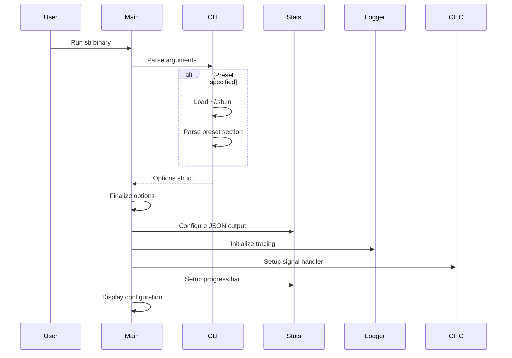

**Steps:**

1. **Argument Parsing** (`Options::initialise()`)
   - Parse command-line with clap
   - If `--preset` specified, load INI file
   - Merge preset with CLI overrides
   - Return (Options, command_line_string)

2. **Finalization** (`Options::finalise()`)
   - Calculate derived fields (key_size, etc.)
   - Validate option combinations
   - Parse setget ratio if needed
   - Extract vector DB configuration

3. **Logging Setup**
   - Configure `tracing_subscriber`
   - Set log level from options
   - Enable thread names and IDs

4. **Statistics Initialization**
   - Configure output format (JSON vs human)
   - Setup progress bar with total request count
   - Initialize atomic counters

5. **Signal Handling**
   - Install Ctrl+C handler
   - Allows graceful shutdown

---

### 2. Thread Orchestration Workflow

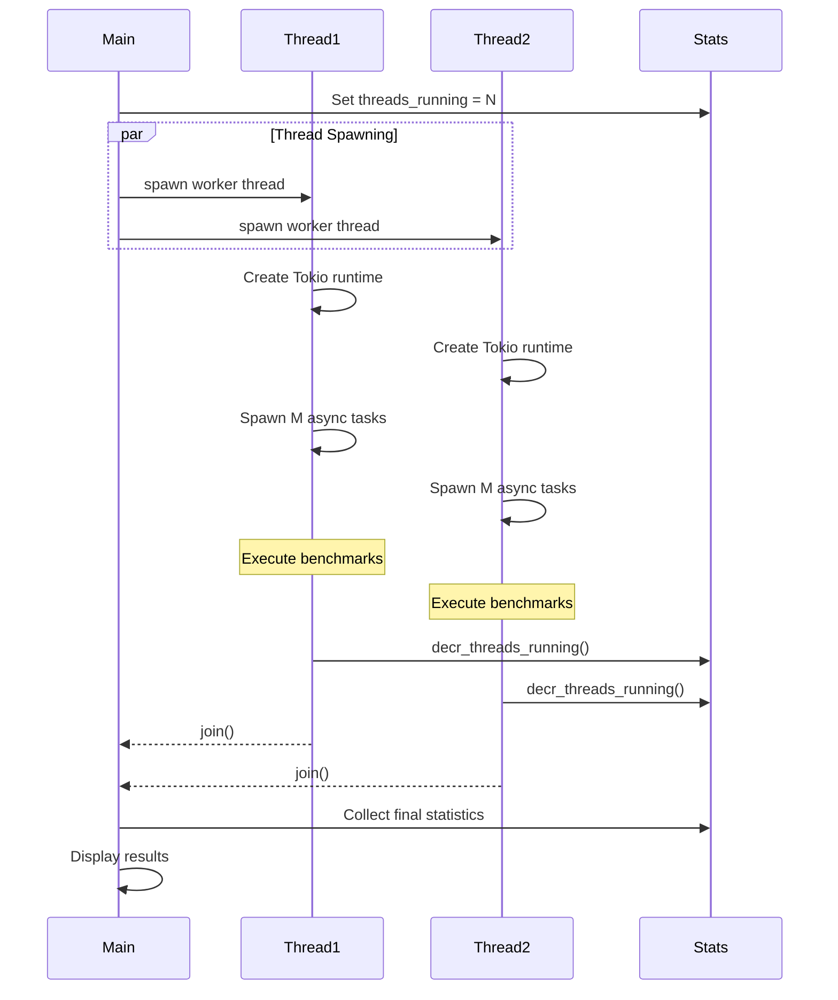

**Thread Distribution:**

Given:
- N = total threads
- C = total connections
- R = total requests

Calculations:
- Connections per thread: `C / N`
- Requests per connection: `R / C`

Example:
- 8 threads, 512 connections, 1,000,000 requests
- Each thread: 64 connections
- Each connection: ~1,953 requests

---

### 3. Task Execution Workflow

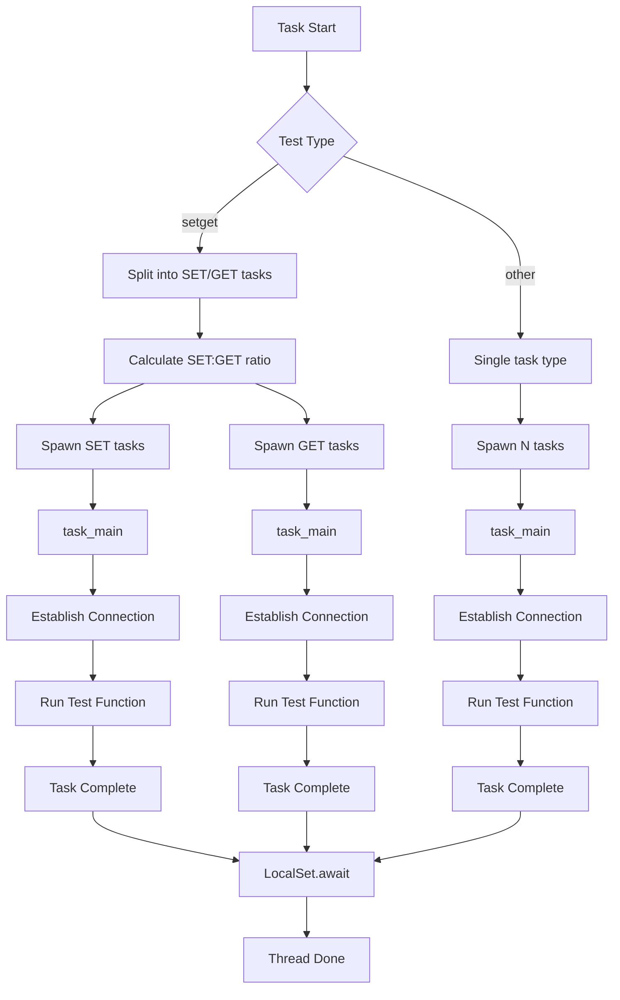

**Special Case: SETGET Test**

For `--test setget --setget-ratio 1:4`:

1. Parse ratio: SET=1, GET=4
2. Calculate multipliers:
   - SET multiplier = 1/(1+4) = 0.2
   - GET multiplier = 4/(1+4) = 0.8
3. If 64 connections:
   - SET tasks = floor(64 × 0.2) = 12
   - GET tasks = ceil(64 × 0.8) = 52
4. Spawn separate task sets with different test types

---

### 4. Connection Establishment Workflow

#### Single-Node Connection

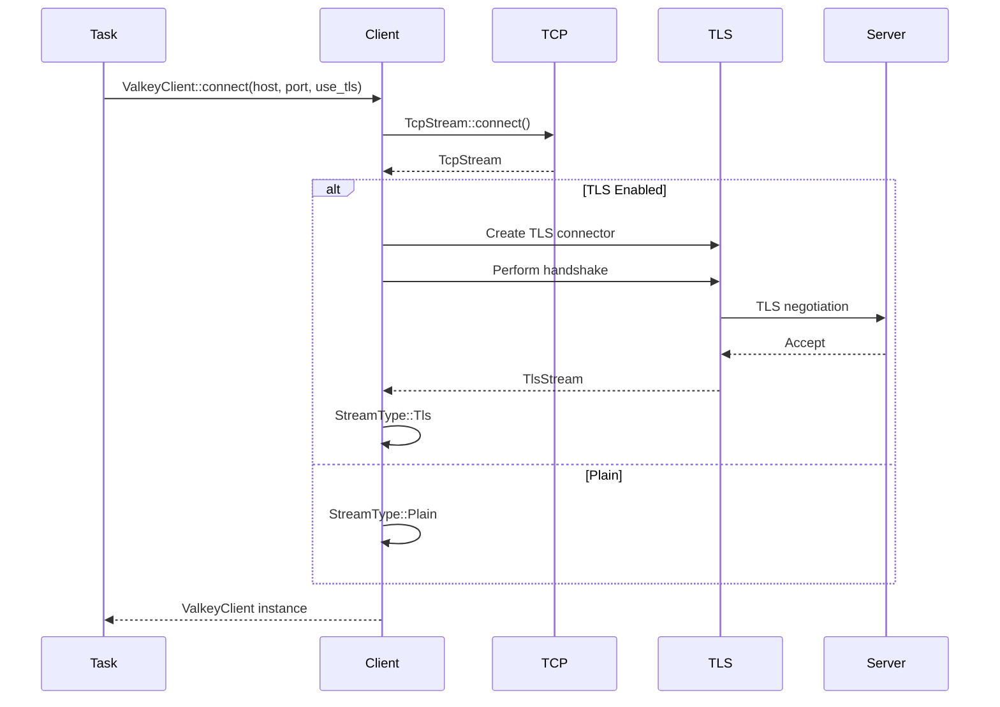

#### Cluster Connection

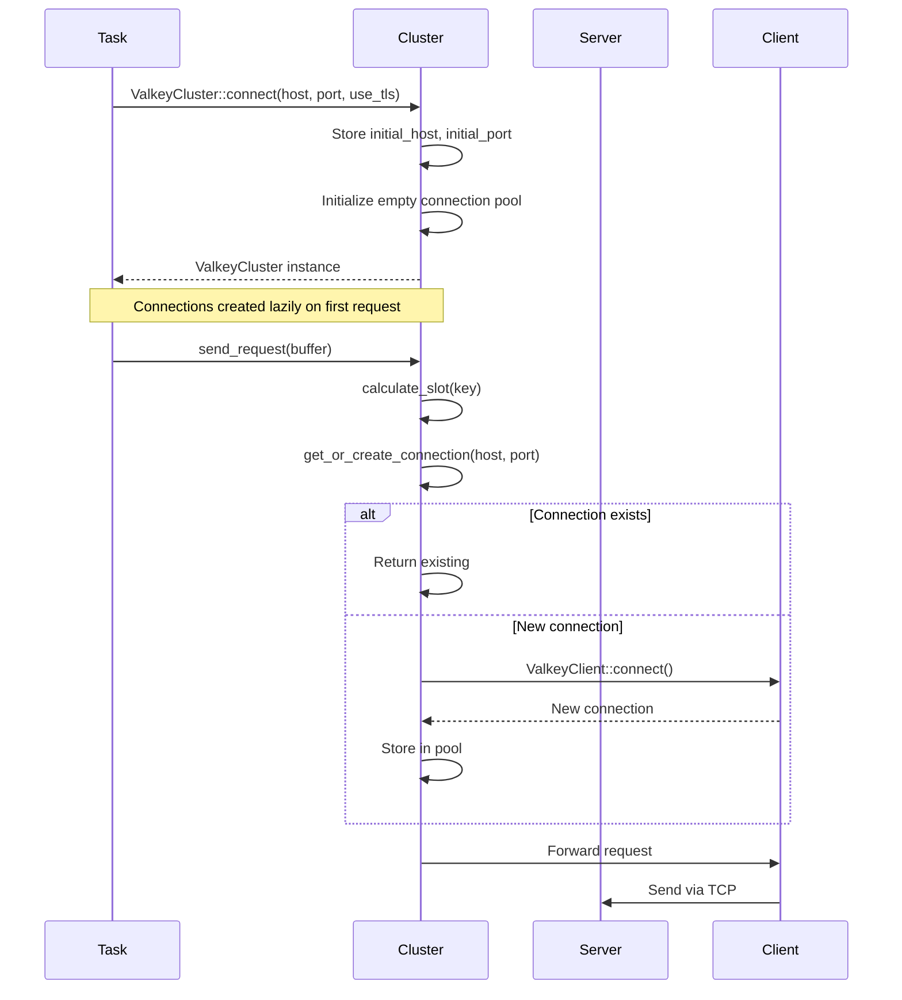

---

### 5. Benchmark Test Execution Workflow

#### Generic Test Pattern

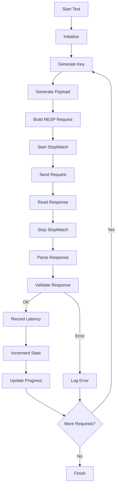

#### Example: SET Test Workflow

```rust
async fn run_set(
    mut conn: impl Connection,
    opts: Options,
    requests_count: usize
) -> Result<(), Box<dyn std::error::Error>> {
    let builder = RespBuilderV2::default();
    let mut buffer = BytesMut::new();
    let sw = StopWatch::default();
    
    for _ in 0..requests_count {
        // 1. Generate test data
        let key = bench_utils::generate_key(
            opts.get_key_size(),
            opts.key_range
        );
        let value = bench_utils::generate_payload(opts.data_size);
        
        // 2. Build RESP command
        buffer.clear();
        builder.add_array_len(&mut buffer, 3);
        builder.add_bulk_string(&mut buffer, b"SET");
        builder.add_bulk_string(&mut buffer, &key);
        builder.add_bulk_string(&mut buffer, &value);
        
        // 3. Execute with timing
        sw.start();
        let response_buffer = conn.send_request(&buffer).await?;
        sw.stop();
        
        // 4. Parse and validate
        let (_, response) = parse_response(&response_buffer)?;
        expect_ok(&response)?;
        
        // 5. Record metrics
        stats::record_latency(sw.elapsed_micros());
        stats::incr_requests_processed(1);
        stats::update_progress(1);
    }
    
    Ok(())
}
```

---

### 6. RESP Protocol Communication Workflow

#### Request Building

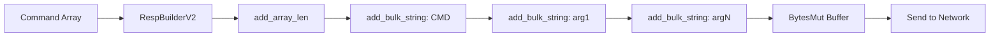

**Example Construction:**

Command: `SET mykey myvalue`

```
add_array_len(3)     -> *3\r\n
add_bulk_string(SET) -> $3\r\nSET\r\n
add_bulk_string(key) -> $5\r\nmykey\r\n
add_bulk_string(val) -> $7\r\nmyvalue\r\n

Final: *3\r\n$3\r\nSET\r\n$5\r\nmykey\r\n$7\r\nmyvalue\r\n
```

#### Response Parsing

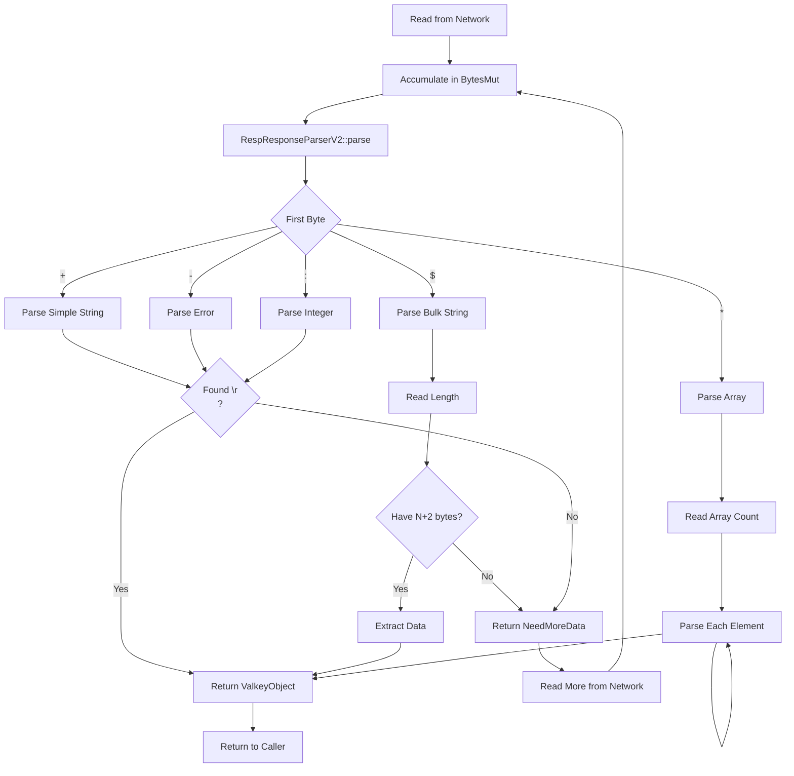

---

### 7. Cluster Request Routing Workflow

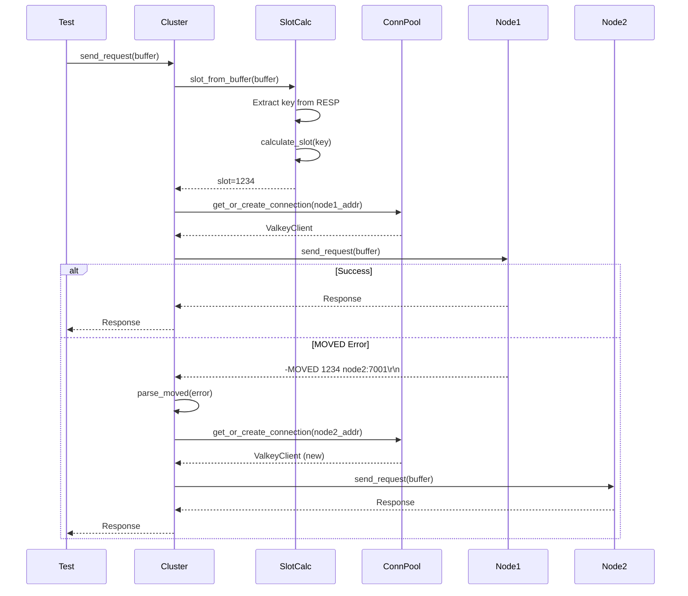

**Slot Calculation Details:**

```
Key: "user:123:profile"
1. Check for hashtag: None found
2. Use full key: "user:123:profile"
3. CRC16(key) = X
4. Slot = X % 16384

Key: "user:{123}:profile"
1. Check for hashtag: Found "{123}"
2. Extract: "123"
3. CRC16("123") = Y
4. Slot = Y % 16384
```

---

### 8. Statistics Collection Workflow

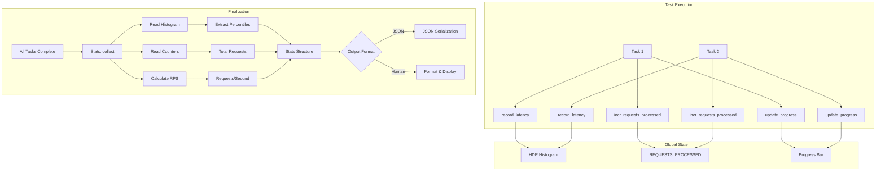

**Lock-Free Design:**
- Atomic counters for request tracking
- Single mutex for histogram (rare contention)
- Progress bar updates batched
- No locks in hot path (request execution)

---

### 9. Pipeline Workflow

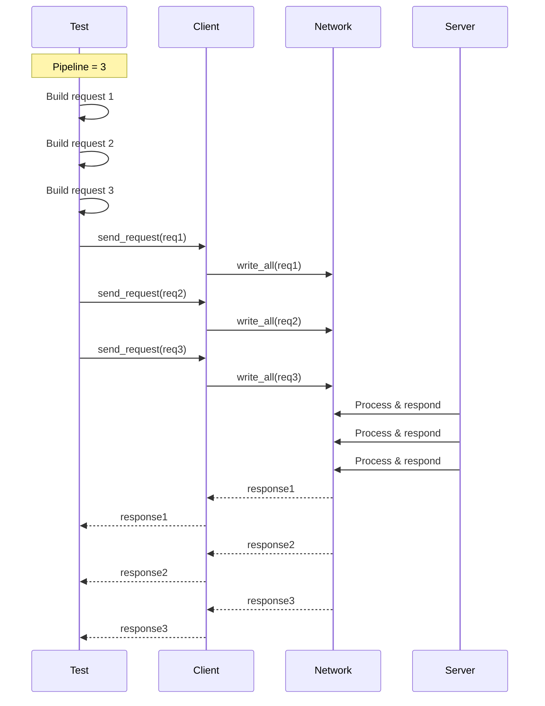

**Implementation Note:** Current implementation sends one request at a time. True pipelining (batching multiple requests before reading responses) would require modifications to the Connection trait.

---

### 10. Error Handling Workflow

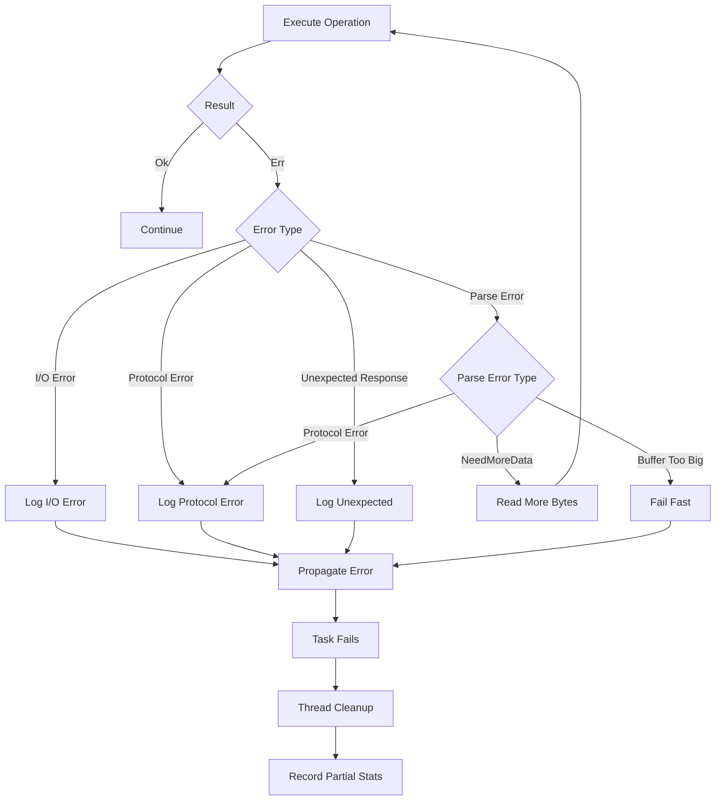

**Error Propagation:**
1. Low-level errors (I/O, parse) -> CommonError
2. Test validation errors -> BenchmarkError
3. Both propagate up via `?` operator
4. Thread catches and logs
5. Other threads continue execution

---

### 11. Graceful Shutdown Workflow

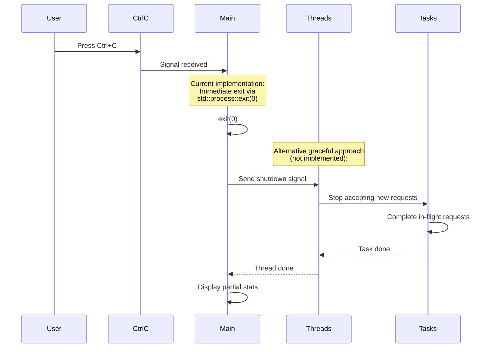

**Current Behavior:** Immediate exit on Ctrl+C via `std::process::exit(0)`

**Potential Enhancement:** Could implement graceful shutdown with:
- Shared atomic flag
- Tasks check flag periodically
- Complete in-flight requests
- Report partial statistics

---

### 12. Preset Loading Workflow

```mermaid
flowchart TB
    Start[User invokes<br/>sb --preset name] --> LoadINI[Load ~/.sb.ini]
    LoadINI --> ParseINI[Parse INI file]
    ParseINI --> FindSection{Section [name]<br/>exists?}
    
    FindSection -->|No| Error[Error: Preset not found]
    FindSection -->|Yes| ExtractArgs[Extract argument string]
    
    ExtractArgs --> ParseArgs[Parse as CLI args]
    ParseArgs --> CreateOptions[Create Options struct]
    CreateOptions --> MergeCLI[Merge with CLI overrides]
    MergeCLI --> Finalize[Finalize options]
    Finalize --> Execute[Execute test]
    
    Error --> Exit[Exit with error]
```

**INI File Structure:**
```ini
[preset-name]
--option1 value1
--option2 value2
-shortopt value3
```

**Command-Line Override:**
```bash
sb --preset mypreset --threads 16
# Preset values + threads=16 override
```

---

### 13. Vector DB Ingestion Workflow

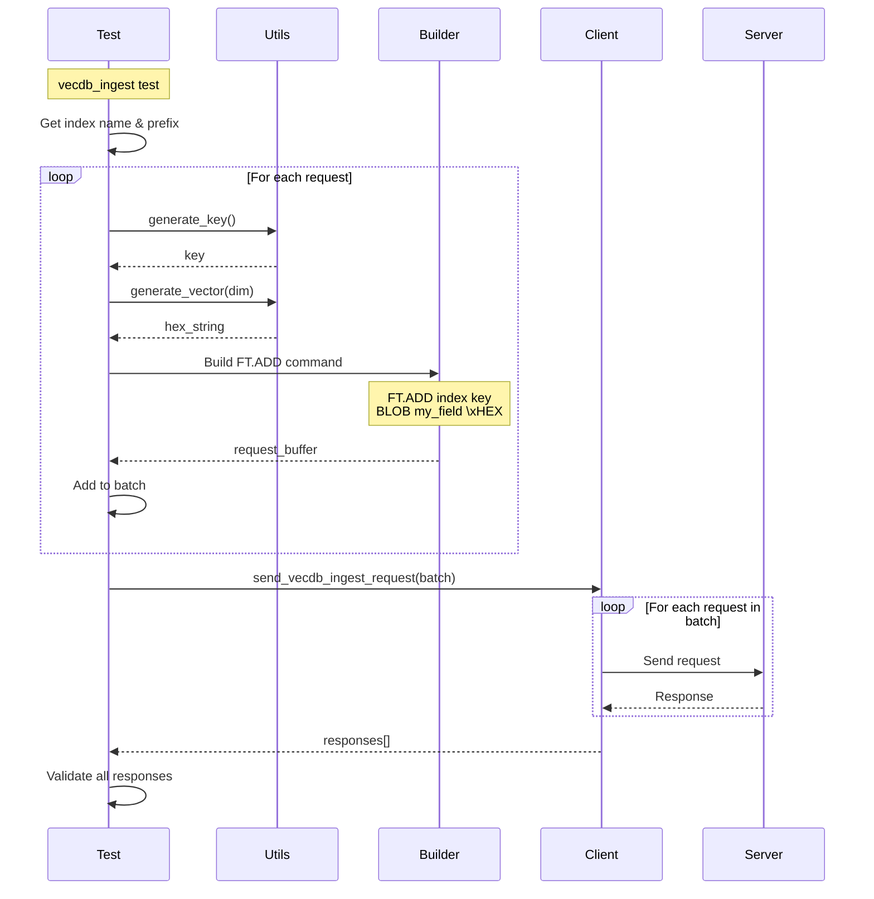

**Special Features:**
- Batches multiple FT.ADD commands
- Generates random float32 vectors
- Hex-encodes vectors with `\x` prefix
- Uses special connection method for batch sending

---

## Common Patterns

### Pattern 1: Request-Response Cycle

```rust
// 1. Build request
let mut buffer = BytesMut::new();
builder.add_array_len(&mut buffer, args.len() + 1);
builder.add_bulk_string(&mut buffer, b"COMMAND");
for arg in args {
    builder.add_bulk_string(&mut buffer, arg);
}

// 2. Send with timing
stopwatch.start();
let response = connection.send_request(&buffer).await?;
stopwatch.stop();

// 3. Parse and validate
let (_, obj) = parse_response(&response)?;
validate_response(&obj)?;

// 4. Record stats
stats::record_latency(stopwatch.elapsed_micros());
stats::incr_requests_processed(1);
```

### Pattern 2: Connection Lazy Initialization

```rust
// Cluster maintains connection pool
async fn get_or_create_connection(&mut self, host: &str, port: u16) {
    let key = format!("{}:{}", host, port);
    
    if !self.connections.contains_key(&key) {
        let conn = ValkeyClient::connect(
            host.to_string(),
            port,
            self.use_tls
        ).await?;
        self.connections.insert(key.clone(), conn);
    }
    
    self.connections.get_mut(&key)
}
```

### Pattern 3: Progress Tracking

```rust
// Setup (once)
stats::finalise_progress_setup(total_requests as u64);

// During execution (each task)
stats::update_progress(1);

// Cleanup (once)
stats::finish_progress();
```
